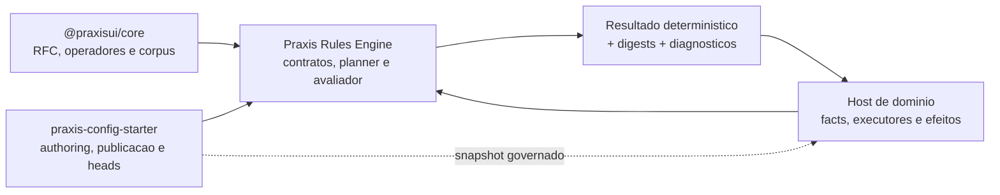

# Documentacao do Praxis Rules Engine

O Praxis Rules Engine e o runtime Java puro e deterministico da plataforma para JSON Logic e RuleSets. Ele nao e um control plane, workflow engine ou mecanismo de persistencia.

## Trilhas de leitura

| Objetivo | Leitura recomendada |
| --- | --- |
| Entender os limites e ownership | [Arquitetura](architecture.md) e [ADRs](p2f-rule-platform-adrs.md) |
| Integrar um host de dominio | [Guia de integracao](host-integration-guide.md) |
| Autorizar/publicar snapshots governados | [Guia de integracao](host-integration-guide.md#snapshots-governados) e a documentacao de `domain-rules` do Config Starter |
| Consultar APIs, contratos e diagnosticos | [Referencia de contratos](contracts-reference.md) e [Diagnosticos e limites](diagnostics-and-limits.md) |
| Criar extensoes Java ou transformacoes | [Extensoes e transformacoes](extensions-and-transformations.md) |
| Entender a evidencia de testes | [Evidencia de validacao](validation-evidence.md) |
| Alterar o dialeto JSON Logic | [RFC normativo no Praxis Core](../../praxis-ui-angular/projects/praxis-core/docs/rfc-json-logic-semantics.md), [matriz de operadores](operator-conformance-matrix.md) e corpus compartilhado |
| Publicar uma versao | [Release](../RELEASING.md) e [estado de release](release-readiness.md) |

## Ownership canonico

- `@praxisui/core` possui o dialeto JSON Logic, o RFC e o corpus de conformidade.
- Este modulo possui o runtime Java, os contratos runtime-neutros, o planner e o avaliador.
- `praxis-config-starter` possui authoring, aprovacoes, persistencia/publicacao de snapshots, heads e rollback.
- O host possui facts, executores Java, autorizacao, transacoes, efeitos e observabilidade.

Nao converta um erro tecnico em `DENY`, nao crie regras compartilhadas em telas e nao mova I/O, persistencia ou efeitos para este JAR.

## Mapa conceitual

As setas solidas mostram dependencia de contrato ou chamada de runtime. A seta
tracejada representa a entrega de um snapshot governado: o Config Starter
publica, mas o host compila e ativa a candidata com seu registry executavel.

## Validacao documental

Execute `python scripts/validate_doc_links.py` na raiz do repositorio para
validar links Markdown locais e impedir referencias a caminhos de maquina. O
mesmo gate roda antes do Maven no CI.
