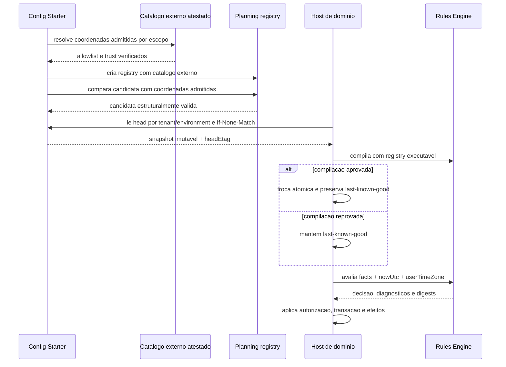

# Guia de integracao de host

## Fluxo canonico

O host resolve facts, fornece executores Java puros, compila uma definicao imutavel e avalia um plano deterministico. O engine nao le banco, nao consulta relogio do processo e nao aplica writes.



```java
RuleBindingExecutorRegistry registry = new RuleBindingExecutorRegistry(List.of(
        new EligibilityExecutor()));

RuleDecisionPlan plan = new PraxisRulePlanCompiler(registry).compile(definition);
RuleEvaluationResult result = new PraxisRuleSetEngine(registry)
        .evaluate(plan, facts, nowUtc, userTimeZone);
```

`facts` deve ser um snapshot JSON ja autorizado e resolvido pelo host. `nowUtc` e `userTimeZone` sao obrigatorios em toda avaliacao de RuleSet, inclusive quando a definicao atual nao usa operador temporal; nunca delegue isso ao timezone ou relogio do processo.

## Executores Java

Um executor e puro, namespaced e versionado de forma exata:

```java
final class EligibilityExecutor implements RuleBindingExecutor {
    public String implementationKey() { return "benefits:eligibility"; }
    public String implementationVersion() { return "1.0.0"; }
    public RuleExecutorResult evaluate(RuleExecutorContext context) {
        return RuleExecutorResult.allow();
    }
}
```

Executores nao podem realizar I/O ou efeitos. Um binding persistido referencia a chave e a versao exatas; a compatibilidade e verificada no planejamento e novamente na avaliacao.

## Resultado e acao do host

| Decisao | Significado | Acao do host |
| --- | --- | --- |
| `ALLOW` | Decisao terminal permitiu a operacao | Pode continuar para a politica/autorizacao do host. |
| `DENY` | Regra de negocio negou | Exponha a negativa de negocio e os reason codes permitidos. |
| `NOT_APPLICABLE` | Nenhuma decisao terminal se aplica | Nao trate como `ALLOW` sem politica explicita do caso de uso. |
| `INCONCLUSIVE` | Facts ou pre-condicoes insuficientes | Resolva facts ou siga a `RuleFailPolicy` no host. |
| `TECHNICAL_ERROR` | Falha de runtime, limite ou executor | Registre de forma segura; nunca a converta em negativa de negocio. |

Use `planDigest`, `factsDigest`, `compatibility` e `implementationRefs` para correlacao/auditoria. Facts e outputs nao devem ser gravados automaticamente pelo engine.

## Snapshots governados

O Config Starter publica `PublishedRuleSnapshot`; o host deve compilar a candidata fora do caminho de requisicao e trocar a referencia ativa apenas quando a compilacao for bem-sucedida:

```java
CompiledRuleSnapshot prepared = new PraxisRuleSnapshotCompiler(registry)
        .compile(snapshot, "my-domain-host/1.0");
// O host realiza aqui a troca atomica da referencia ativa e preserva last-known-good.
```

O control plane pode usar `RuleBindingExecutorRegistry.planning(declarations)` para provar coordenadas permitidas sem instanciar codigo do host. Esse registry nao executa bindings Java; somente o host fornece o registry executavel.

Head ETag, ativacao, rollback, cache e persistencia pertencem ao Config Starter/host. Um rollback para o mesmo conteudo precisa de nova identidade de ativacao no control plane; o hash de conteudo permanece estavel.
