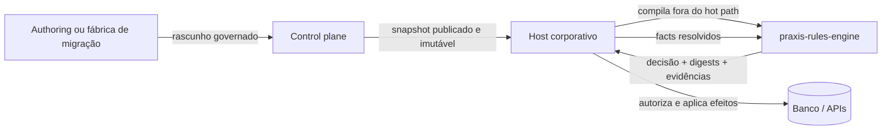
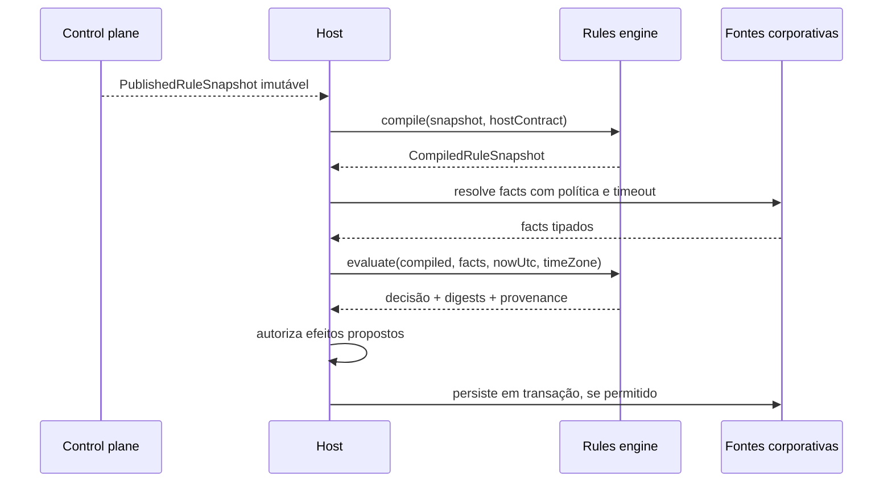
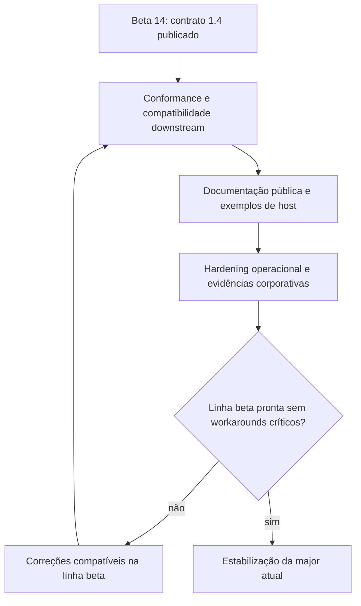

# Integração de plataforma e evolução

Este guia explica onde o `praxis-rules-engine` termina, como ele participa de
uma solução governada de regras e quais responsabilidades pertencem ao control
plane e ao host. O projeto é open source, independente de um produto de
negócio específico e apropriado para hosts Java que precisem de decisões
reprodutíveis e auditáveis.

## Visão em uma página

O motor é deliberadamente pequeno: recebe contratos imutáveis e fatos já
resolvidos, valida, compila e avalia. Ele não publica regras, não busca dados,
não executa SQL e não persiste efeitos. Essa separação evita que I/O,
credenciais, estado mutável ou política de implantação contaminem a semântica
determinística.

## Responsabilidades

| Camada | Responsabilidade | Fora de escopo |
|---|---|---|
| Motor | validação, compilação, avaliação, agregação de decisões e digests | Spring, HTTP, banco, tenant, autenticação e efeitos |
| Control plane | versões, head, ETag, revisão, publicação, rollback e snapshots | decidir no hot path do domínio |
| Host | resolver facts, selecionar snapshot, autorizar extensões, aplicar efeitos e auditar | redefinir silenciosamente o dialeto |
| Authoring/migração | produzir rascunhos, documentação e evidências para revisão | promover automaticamente uma regra sem governança |

## Fluxo de execução

O snapshot deve ser preparado antes da troca da referência ativa. Uma falha de
compilação não substitui a versão saudável. Durante a avaliação, as coordenadas
das implementações Java são revalidadas, impedindo drift entre o plano
compilado e o registry efetivamente usado.

## Contratos centrais

- `RuleSetDefinition` descreve composição, slots, bindings e política de decisão.
- `PublishedRuleSnapshot` identifica conteúdo publicado e compatibilidade.
- `CompiledRuleSnapshot` é o artefato preparado para execução concorrente.
- `RuleEvaluationResult` preserva decisão, razões, digests, baseline e proveniência.
- `RuleBindingExecutorRegistry` registra implementações Java por chave e versão exatas.

Decisões não são reduzidas prematuramente a booleanos. Estados como
`NOT_APPLICABLE`, `INCONCLUSIVE` e `TECHNICAL_ERROR` permanecem distintos de
`ALLOW` e `DENY`, pois exigem tratamento operacional e de negócio diferente.

## Determinismo e auditabilidade

O resultado é reprodutível quando snapshot, fatos, relógio explícito, fuso,
versões do motor e executores são os mesmos. Para sustentar essa propriedade:

- operadores temporais recebem `nowUtc` e `userTimeZone` explicitamente;
- mapas, resultados e diagnósticos têm ordenação e limites definidos;
- `planDigest`, `factsDigest` e `snapshotContentHash` permitem correlação;
- extensões precisam de coordenada exata e trust atestado pelo host;
- efeitos são propostas tipadas, nunca gravações executadas pelo motor;
- falhas de contrato e infraestrutura não viram decisões de negócio convenientes.

## Extensões e transformações

Extensões Java de cliente são negadas por padrão. O host pode habilitar apenas
slots explicitamente customizáveis, depois de verificar assinatura, origem e
allowlist do artefato. A attestation participa do plano e do resultado. Um
executor customizado não pode substituir um `PROTECTED_GUARD`.

Transformações retornam `TRANSFORMATION_INTENT`, contendo valores tipados de
`before` e `after`, destino, schema e proveniência. Cabe ao host validar o
schema governado, autorização, concorrência/ETag e transação antes de aplicar a
mudança.

## Como integrar em um host corporativo

1. Fixe a coordenada Maven e a versão de contrato aceitas pelo host.
2. Registre executores conhecidos por chave e versão exatas.
3. Obtenha apenas snapshots publicados e valide sua integridade.
4. Compile o novo snapshot fora do caminho crítico.
5. Troque a referência ativa atomicamente somente após sucesso.
6. Resolva facts com autenticação, autorização, timeout e classificação de dados.
7. Avalie com relógio e fuso explícitos.
8. Registre decisão, digests, snapshot e correlation ID.
9. Submeta efeitos a políticas, schema, concorrência e transação.
10. Mantenha rollback para o último snapshot saudável.

## Segurança empresarial

O motor não é sandbox para código arbitrário. Organizações devem combinar o
JAR com controles externos: cadeia de suprimentos assinada, SBOM, allowlist,
segregação de funções, revisão de publicação, isolamento de tenant, retenção de
auditoria, proteção de dados sensíveis e observabilidade sem exposição de
facts. O log deve favorecer hashes e identificadores governados, não payloads
integrais.

## Estado público atual

- Coordenada: `io.github.codexrodrigues:praxis-rules-engine:0.1.0-beta.14`.
- Contrato do motor: `1.4`.
- Baseline: Java 21 e Maven 3.9+.
- Publicação: workflow oficial por tag, com artefatos assinados no Maven Central.
- Prova downstream: host de referência consumindo apenas a coordenada pública.

A beta.14 permanece disponível, mas não é recomendada para novos consumidores:
ela anuncia hash diferente dos bytes do corpus empacotado. A fonte atual prepara
a beta.15 corretiva; somente sua publicação e um novo smoke downstream poderão
restaurar a recomendação pública do contract `1.4`.

O `pom.xml` do branch de desenvolvimento continua em `0.0.1-SNAPSHOT`; isso não
altera a coordenada pública recomendada.

## Evolução planejada

As próximas entregas devem preservar a fronteira Java pura:

- ampliar corpus de conformidade entre runtimes Java e TypeScript;
- manter testes de propriedades determinísticas e limites adversariais;
- enriquecer Javadocs, exemplos e matriz de compatibilidade;
- validar consumidores reais após cada publicação pública;
- consolidar critérios de suporte e segurança para uma versão estável.

Uma nova major só é adequada diante de breaking changes governadas. O simples
avanço do tempo ou da numeração beta não justifica ruptura.

## Onde aprofundar

- [Arquitetura](architecture.md)
- [Guia de integração do host](host-integration-guide.md)
- [Matriz de conformidade](operator-conformance-matrix.md)
- [Prontidão de release](release-readiness.md)
- [ADRs da plataforma](p2f-rule-platform-adrs.md)
- [Transformações tipadas](p2f-adr-11-typed-transformations.md)
