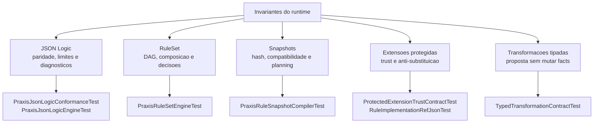
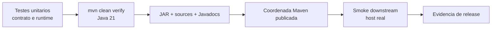

# Evidencia de validacao

Esta pagina mapeia testes existentes para os invariantes que sustentam o
contrato. Ela descreve cobertura de codigo; nao substitui a execucao dos gates
de release nem prova consumo de uma coordenada ainda nao publicada.



## O que cada grupo demonstra

| Grupo | Evidencia coberta | Testes principais |
| --- | --- | --- |
| Dialeto JSON Logic | Corpus Angular empacotado, catalogo de operadores, erros estruturados, missing vs. `null`, regex, limites, tempo e determinismo. | `PraxisJsonLogicConformanceTest`, `PraxisJsonLogicEngineTest` |
| Plano e decisao | Ordenacao DAG, ciclos, roots, versoes de executor, precedencia de `DENY`, `NOT_APPLICABLE`, `INCONCLUSIVE` e bloqueio de intents. | `PraxisRuleSetEngineTest` |
| Snapshot | Canonicalizacao, hash de conteudo, contrato do host, proveniencia e registry somente de planejamento. | `PraxisRuleSnapshotCompilerTest` |
| Extensao de cliente | Default-deny, atestacao obrigatoria, guard protegido, digest com trust e rejeicao de substituicao de artefato. | `ProtectedExtensionTrustContractTest`, `RuleImplementationRefJsonTest` |
| Transformacao | Proveniencia, ausencia vs. `null`, schema/path, conflito, limites e ausencia de mutacao dos facts. | `TypedTransformationContractTest` |

## Gates e fronteiras de prova



`mvn clean verify` prova o engine no seu repositorio. A prova de integracao
somente se completa quando um consumidor resolve a coordenada publicada sem
override local. Para a candidata `1.3`, o requisito adicional e provar o
catalogo externo de `RuleExtensionTrust` no control plane e no host consumidor.

## Execucao focal desta revisao

Em 2026-07-17, a bateria focal abaixo foi executada com Java 21 e concluiu com
**52 testes aprovados, sem falhas, erros ou skips**:

```powershell
mvn "-Dtest=PraxisJsonLogicConformanceTest,PraxisJsonLogicEngineTest,PraxisRuleSetEngineTest,PraxisRuleSnapshotCompilerTest,ProtectedExtensionTrustContractTest,RuleImplementationRefJsonTest,TypedTransformationContractTest" test
```

Essa execucao valida os contratos ilustrados nesta pagina. Ela nao substitui
`mvn clean verify`, nem a prova downstream contra uma coordenada Maven publica.

## Reprodutibilidade entre sistemas operacionais

A auditoria de 2026-07-21 reproduziu uma falha da tag `v0.1.0-beta.15` no
Windows: sem `.gitattributes`, `core.autocrlf=true` alterava os bytes do corpus
empacotado e invalidava o SHA-256 normativo. A correcao preserva o gate
byte a byte, fixa LF para textos do repositorio e executa `mvn clean verify`
tambem em `windows-latest`. Um verde apenas em Linux nao e evidencia suficiente
para declarar reprodutivel uma release cujo contrato inclui bytes e hash.

Com a política LF aplicada, `mvn clean verify` em Java 21 no Windows executou
62 testes, sem falhas, erros ou skips. A paridade focal também foi executada
com `praxis.angular.corpus.path` apontando explicitamente para o corpus Angular.
